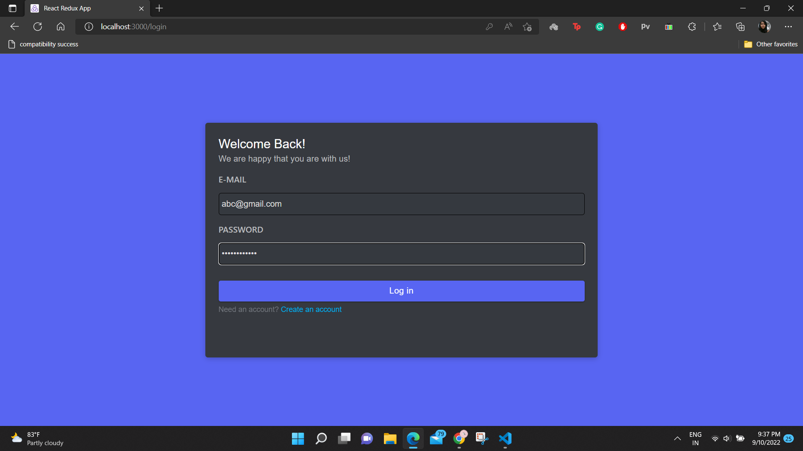
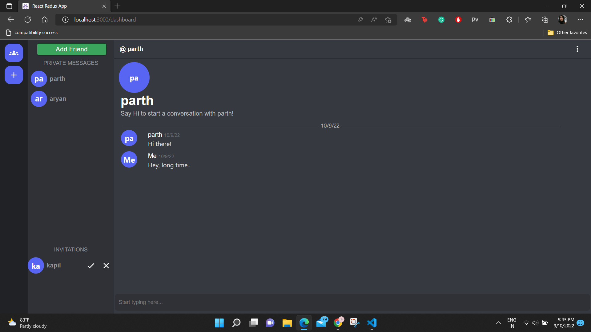
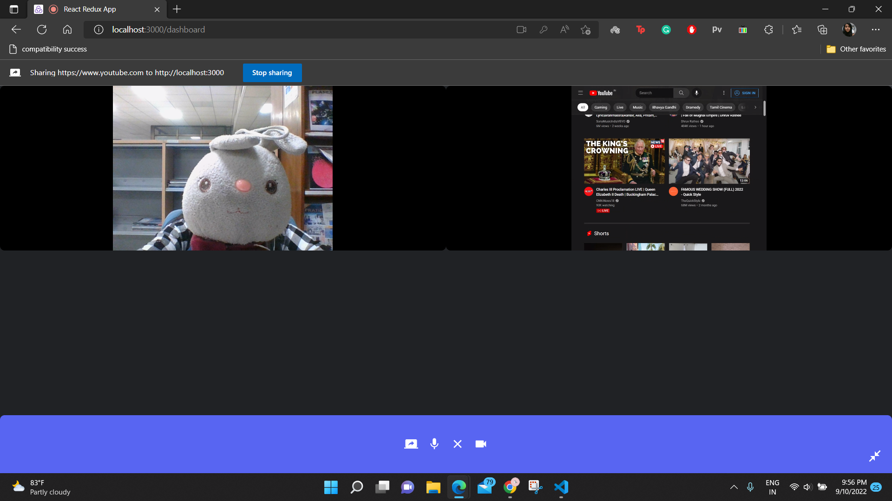

# Discord-Clone

The Backend Code of Discord-Clone with various features like screen sharing, realtime chatting, audio and video calls.
All of this, just supported in group calls too.
 
## Tech Stack

**Server:** Node, Express, MongoDB, Socket.IO


## Run Locally

Clone the project

```bash
  git clone https://github.com/Saloniaga/my_discord_back.git
```
Install dependencies

```bash
  npm install --save
```

Start the server

```bash
  npm start
```


## Features

- Login/Registration using JWT Token
- Users can send, accept or decline friends invitations.
- Realtime Chat functionality
- Audio and Video group calls possible
- Create, Join and Leave Rooms anytime.
- Screen Share feature available in rooms.


## Screenshots

The Login & Register Page.



The homepage has a dashboard with the list of your friends and the pending friends invitation.



A user can create a room where maximun 4 people can join. It provides audio, video and screen share facilities.




